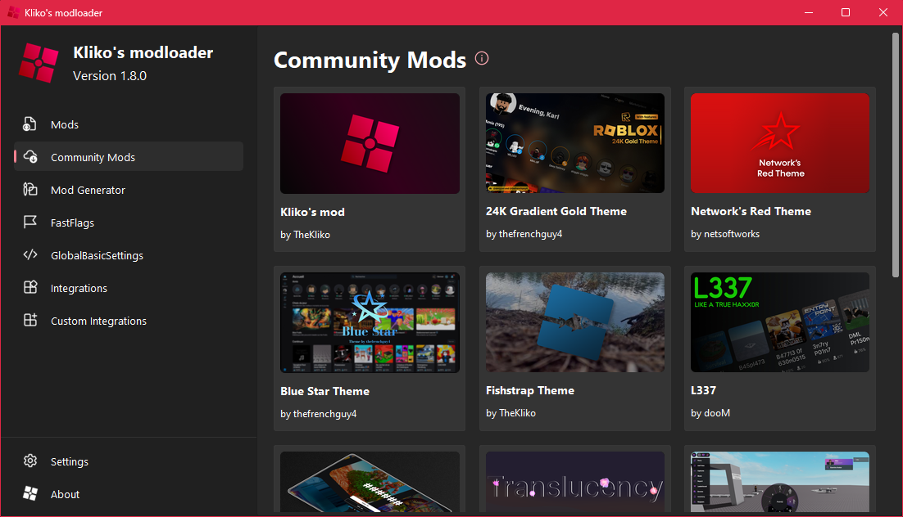

> [!IMPORTANT]
> I am officially ending development for Kliko's modloader,
> thank you all for your support ❤️

<h3>Roblox mods made easy</h3>

Kliko's modloader is an open-source modloader for <a href="https://www.roblox.com">Roblox</a>, it serves as a wrapper around Roblox's default launcher. If you have any questions, please read the FAQ, [check the wiki](https://github.com/klikos-modloader/klikos-modloader/wiki) or join our official [support server](https://discord.gg/nEjUwdSP9P).

<h2>Quick Access</h2>
<ul>
    <li>
        <a href="#features">Features</a>
    </li>
    <li>
        <a href="#installation-guide">Installation Guide</a>
    </li>
    <li>
        <a href="#support-server">Support Server</a>
    </li>
    <li>
        <a href="#inspiration">Inspiration</a>
    </li>
</ul>

<h2 id="features">Features</h2>

<h3>Advanced modloader</h3>
Each mod can be toggled on or off, change the load order to make sure your mods are applied in the right order.

<h3>Mod generator</h3>
Don't know how to make mods yourself? Try out our mod generator, creating mods has never been easier!

<h3>Automatic mod updates</h3>
I have integrated my <a href="https://github.com/TheKliko/klikos-modding-tool">modding tool</a> to automatically update compatible mods.

<h3>Community mods</h3>
Browse community-made mods within the modloader menu.

<h3>Discord RPC and BloxstrapRPC SDK</h3>
Shows your current game on Discord. The <a href="https://github.com/pizzaboxer/bloxstrap/wiki/Integrating-Bloxstrap-functionality-into-your-game">BloxstrapRPC</a> SDK allows games to set custom RPC data.

<h2 id="installation-guide">Installation Guide</h2>

Follow these instructions to install Kliko's modloader.

<ol>
    <li>
        Download and install the <a href="https://github.com/TheKliko/klikos-modloader/releases/latest">latest release</a>.
    </li>
    <li>
        Run the 'Modloader Menu' shortcut to adjust your settings and configure your mods.
    </li>
    <li>
        Run the 'Launcher' shortcut to launch modded Roblox.
    </li>
</ol>

<h2 id="support-server">Support Server</h2>

<h3>Join our discord server</h3>

This is the official support server for Kliko's modloader, join our community to give feedback, ask for help, share your mods, and talk with other mod creators.

<h3>Support</h3>

Are you having issues during setup? Have you encountered a bug? Do you need help with your mods? Or do you have another issue related to this program? We are happy to assist you, <a href='https://discord.gg/nEjUwdSP9P'>join our server</a> and open a ticket or ask for help in one of the channels.

<h3>Feedback</h3>

We are always open to feedback. If you have a suggestion, found a bug or just want to share your thoughts, please join the server and let us know.

<h3>Mod sharing</h3>

Find more mods — or share your own — in our #mod-sharing channel.

<h2 id="inspiration">Inspiration</h2>

This project is inspired by <a href='https://github.com/pizzaboxer/bloxstrap'>Bloxstrap</a>, an alternative bootstrapper for Roblox with a bunch of
extra features. Bloxstrap is what introduced me to the world of Roblox modding and what led to me creating my own mods. However, at the time of writing this, Bloxstrap’s mod support is very limited, even more so when you are managing and developing many different mods at the same time. Because of this, I’ve decided to build my own software dedicated to Roblox modding.

<h2 id="disclaimer">Disclaimer</h2>

Kliko’s Modloader is an independently developed project by TheKliko. It is not affiliated with, endorsed by, or associated with Kliko Groep B.V. in any way.
